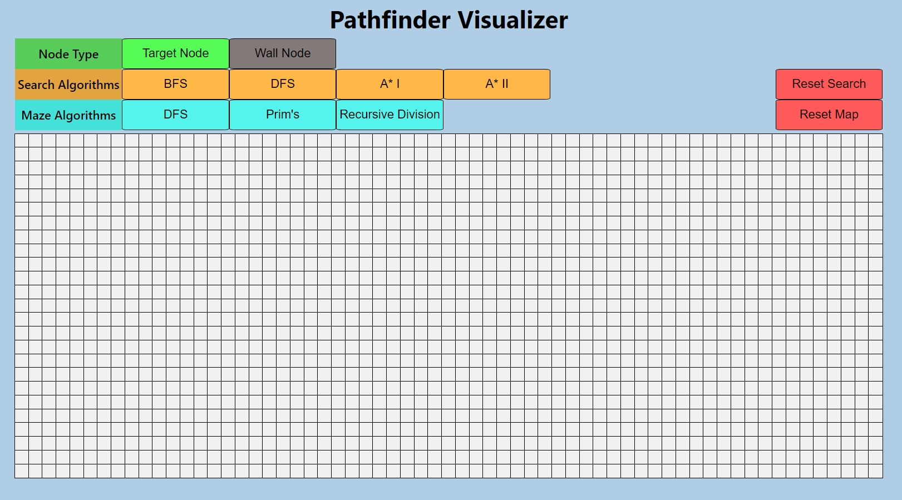
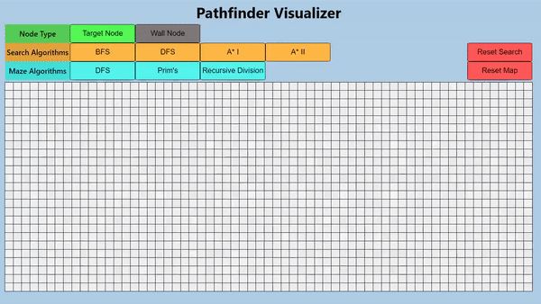

# Pathfinder Visualizer

A visualizer for pathfinding and maze generating algorithms

# Features

<!--  -->

## Node Type

- Click the type of nodes you want to place, then simply click on the board to place or click and drag to place multiple nodes quickly
- Target Nodes are nodes

## Search Algorithms

- Breadth First Search (BFS)
- Depth First Search (DFS)
- A* with heuristic as **number of moves + manhattan distance** (A* I)
- A* with heuristic as **manhattan distance** (A* II)
- Reset Search - **only** resets the current search, the nodes will remain

## Maze Algorithms

- Randomized Depth First Search (DFS)
- Randomized Prim's (Prim's)
- Recursive Division
- Hunt and Kill
- Reset Map - **only** resets the nodes, the current search will remain

## Other Features And Information

- Iterations counter - the numberof iterations the search has gone through
- Moves counter - when the search reaches a target this counter will update and show the current number of moves for the path found
- Adjustable iteration speed
- Light/Dark Themes
- You may switch algorithms in the middle of a search
- Whilst a maze is being generated please allow it to completely finish, there will be a pop up box while generating

# Demo

<!--  -->

## Authors

- Me
